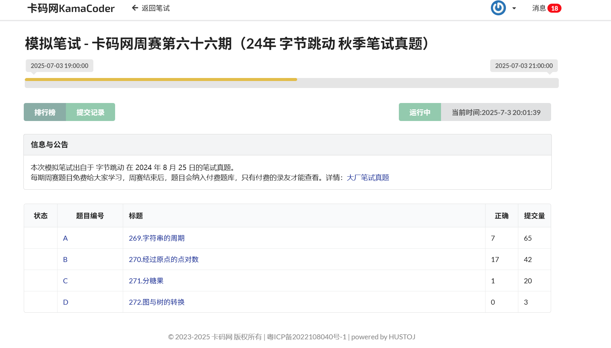

# 卡码网周赛


<!-- toc -->


# 第六十六期——字节跳动面试题

## 整体情况

这里的代码能通过题目中给出的测试用例，但不能完全通过所有测试样例。仅供开拓思路使用。




## 269.字符串的周期

### 题目说明

###### 题目描述

小红有一个长度为n的字符串s，由0、1和 * 组成，可以把*替换成0或者1，小红想知道替换后的字符串的最短周期是多少。如果一个字符串每一个位置的字母都与后k位的字母相同，那么k即为该字符串的一个周期。形式化的说，如果存在一个正整数k 使得对于所有的 i属于[1,n - k] 都有 s[i]= s[i+k] ，那么称k是字符串s的周期。

###### 输入描述

第一行输入一个长度为n(1 <= n <= 1e3)，且只由0、1和*组成的字符串s。

###### 输出描述

输出包含两行，第一行是最短的周期k，

第二行是字符串的周期。如果周期里面包含*，直接输出*即可。例如："10*10*"，最短周期是3，周期是"10*"。如果周期能确定，则输出确定的周期。

###### 输入示例

```
1*011*0*1
```

###### 输出示例

```
4
1*01
```

###### 提示信息

替换为`1*011*011`拥有最短周期。由于\*可以随意变换，所以这里换不换不影响周期的大小。

时间限制：c/c++：1s；java：6s；其他语言：3s。

### 题解

这个问题可以分几步解决：

1. **理解周期定义：**  
    若存在一个正整数 `k`，使得对于所有 `i` 属于 `[1, n - k]`，满足 `s[i] = s[i + k]`，那么 `k` 就是字符串的周期。
2. **考虑 `*` 的情况：**  
    `*` 可以替换成 `0` 或 `1`，因此在确定周期时，两个位置的字符如果都已确定，不同字符时，不可能形成周期；如果一个是 `*`，另一个是 `0` 或 `1`，可以通过替换使两者相等。
3. **寻找最短周期：**  
    从 1 到 `n`，检查它是否满足属于周期的条件。  
    **注意**：只需要在找到第一个满足条件的 `k` 时停止，因为这是最短的。
4. **处理周期字符串：**  
    根据计算的最短周期 `k`，提取字符串的前 `k` 个字符作为周期输出。
    - 如果周期中有 `*`，直接输出 `*`。

方案实现思路：

- 遍历每个可能的周期 `k`；
- 对字符串 `s` 的位置对 `(i, i + k)`，判断字符是否满足：
    - 如果两个字符都已确定，且不同，则 `k` 不成立；
    - 如果其中有 `*`，可以调整成相等；
- 如果满足所有对应位置的条件，返回此 `k`。

代码实现：

```cpp
#include <bits/stdc++.h>
using namespace std;

int main() {
    ios::sync_with_stdio(false);
    cin.tie(nullptr);
    
    string s;
    cin >> s;
    int n = s.size();

    int min_k = n;
    int shortest_period = n + 1;
    string period_str;

    // 从最短周期开始判断
    for (int k = 1; k <= n; ++k) {
        bool valid = true;
        // 检查所有 i
        for (int i = 0; i + k < n; ++i) {
            char c1 = s[i];
            char c2 = s[i + k];

            if (c1 != '*' && c2 != '*') {
                if (c1 != c2) {
                    valid = false;
                    break;
                }
            } 
            // 如果有一个是 '*',可调整匹配，没问题
        }
        if (valid) {
            min_k = k;
            break; // 找到最短的
        }
    }

    // 构造周期字符串
    string cycle = s.substr(0, min_k);
    // 如果周期中有 *, 假设不确定的字符，直接输出*
    for (char &ch : cycle) {
        if (ch == '*') {
            cycle = "*";
            break;
        }
    }

    cout << min_k << "\n";
    cout << cycle << "\n";

    return 0;
}
```

说明：

- 只需从小到大尝试 `k`，找到第一个满足条件的，即最短周期；
- 处理周期字符串时，如果里面有 `*`，就输出 `*`（表示不确定）；
- 时间复杂度：$O(n^2)$，在 `n <= 1000` 时完全可以接受。


# 270.经过原点的点对数


## 题目说明

###### 题目描述

二维平面上有几个整点a[1], a[2], ... , a[n]，其中第i个点的坐标为(i, a[i])。小苯想知道有多少个点对(i, j)满足第i个点和第j个点的连线所在的直线恰好经过原点，请你帮他算一算吧。

你可以假设数组的下标是从1开始的。

###### 输入描述

第一行输入一个正整数n(2  <=  n  < = 2e5)代表整点数量。第二行输入n个正整数[a[1], a[2], ... , a[n]](1 <= a[i] <= 1e9)代表整点的纵坐标。

###### 输出描述

在一行上输出一个正整数，表示连线所在直线经过原点的点对个数。

###### 输入示例

```
5
1 2 4 4 5
```

###### 输出示例

```
6
```

###### 提示信息

时间限制：c/c++：1s；java：5s；其他语言：3s。

## 题解

这题的关键在于理解直线经过原点（0, 0）时，点(i, a[i]) 和点(j, a[j])的连线也会经过原点的条件。

根据数学推导：**两个点满足条件的必要条件是：**  
`a[i] / i` 等于 `a[j] / j`。

由于整数除法可能不精确，建议用分数来表达相等关系，也就是用分子分母化简的形式存储。

具体做法：

1. 遍历每个点 `(i, a[i])`，计算 `a[i] / i` 的简化分数（用两个整数存储），比如 `(numerator, denominator)`。
2. 使用一个哈希表（`map`）统计具有相同 `a[i]/i` 比例的点的个数。
3. 数量满足组合原则：对于每组大小为 `count`，可以组成 `count * (count - 1) / 2` 对点。

代码实现：

```cpp
#include <bits/stdc++.h>
using namespace std;

// 定义自定义哈希函数
struct pair_hash {
    size_t operator()(const pair<long long, long long>& p) const {
        size_t h1 = hash<long long>()(p.first);
        size_t h2 = hash<long long>()(p.second);
        return h1 ^ (h2 + 0x9e3779b9 + (h1 << 6) + (h1 >> 2));
    }
};

// 分数化简函数
pair<long long, long long> reduce_fraction(long long a, long long b) {
    long long g = std::__gcd(a, b);
    a /= g;
    b /= g;
    if (b < 0) {
        b = -b;
        a = -a;
    }
    return {a, b};
}

int main() {
    ios::sync_with_stdio(false);
    cin.tie(nullptr);
    int n;
    cin >> n;
    vector<long long> a(n+1);
    for (int i=1; i<=n; ++i) cin >> a[i];

    unordered_map<pair<long long, long long>, long long, pair_hash> freq;
    long long result = 0;

    for (int i=1; i<=n; ++i) {
        auto frac = reduce_fraction(a[i], i);
        freq[frac]++;
    }

    for (auto &entry : freq) {
        long long count = entry.second;
        if (count > 1) {
            result += count * (count - 1) / 2;
        }
    }

    cout << result << "\n";

    return 0;
}
```

说明：

- 这里用 `reduce_fraction()` 函数将 `(a[i], i)` 的比值化简成最简分数。
- 使用哈希映射统计具有相同比例的点。
- 自定义哈希函数通过简单的异或和混合操作，确保对pair的两个元素进行合理的哈希分布。
- 统计完毕后，利用组合公式计算点对数。


## 271.分糖果（双指针）

### 题目说明

###### 题目描述

小苯面前有n堆糖果，其中第i堆糖果里有a[i]个糖果，小苯现在希望从中选择恰好两堆糖果带走，选择后他会施法将自己的糖果数量乘上k，剩下的所有糖果都是格格的，他希望他和格格的糖果数量尽可能接近，假设小苯拿走的糖果数量为x，格格拿走的数量为y，即他希望:|k * x -  y|的值尽可能小 请你帮他求出这个最小值吧。

###### 输入描述

第一行输入两个正整数n和k (3 <= n ≤ 2e5; 1<= k <= 1e9)代表糖果的堆数和计算的系数；

第二行输入n个整数a[1], a[2], ... , a[n](1 <= a[i] <= 1e9)代表每堆糖果的数量。

###### 输出描述

在一行上输出一个正整数，表示题目所述的最小值。

###### 输入示例

```
5 1 
1 2 3 4 5
```

###### 输出示例

```
1
```

###### 提示信息

小笨拿走 3 和 4即可。剩下的格格可以获得8个，k是1，差值|1 * 7 - 8| = 1.

时间限制：c/c++：1s；java：6s；go：3s；其他语言：9s。

## 题解

这个问题可以通过排序和双指针的方法高效解决。具体思路如下：

1. 输入数据后，将糖果堆的数量数组排序。
2. 选择两堆糖果，使得它们的总和x尽可能使得|k * x - y|最小。这里y是剩下的糖果总和（即除了这两堆之外的糖果总和）。
3. 因为我们需要快速计算剩余糖果的总和，提前算好前缀和以方便计算。

思考细节：

- 假设我们选择第i和第j堆糖果，总和是 `sum_pair = a[i] + a[j]`。
- 剩余糖果总和是 `total - sum_pair`。
- 目标是使得 `|k * sum_pair - (total - sum_pair)|` 最小。
- 移项可以得到：`| (k + 1) * sum_pair - total |`，在实际中，我们应计算两边的差的绝对值。

为了快速找到最接近的值，我们可以利用排序数组的双指针方法，从两头开始快速逼近。

下面我会给出完整的C++实现代码：

```cpp
#include <bits/stdc++.h>
using namespace std;

int main() {
    ios::sync_with_stdio(false);
    cin.tie(nullptr);

    int n;
    long long k;
    cin >> n >> k;
    vector<long long> a(n);
    long long total = 0;
    for (int i=0; i<n; ++i) {
        cin >> a[i];
        total += a[i];
    }

    sort(a.begin(), a.end());

    long long ans = LLONG_MAX; // 初始化为最大值

    int left = 0, right = n - 1;
    // 双指针方式遍历
    while (left < right) {
        long long sum_pair = a[left] + a[right];
        // 计算差值
        long long diff = abs((k + 1) * sum_pair - total);
        if (diff < ans) {
            ans = diff;
        }
        // 根据差值调节指针，尽量找到更接近的值
        // 由于和越大，diff可能越大或越小，双指针做线性调整
        if ((k + 1) * sum_pair < total) {
            left++;
        } else {
            right--;
        }
    }
    cout << ans << "\n";

    return 0;
}
```

说明：

- 利用排序之后，左右两个指针分别指向最小和最大值，逐步逼近目标。
- 计算每次的差值，并不断更新最小值。
- 时间复杂度为O(n log n)（排序部分）和O(n)（双指针遍历），满足题目要求。


## 272.图与树的转换

## 题目说明

###### 题目描述

小红有一张联通无向图，她希望找到这张图的一棵生成树，使得1号点和n号点的度数绝对值之差尽可能大。请你帮助她找到这样一棵生成树 对于一张图，选择其中n-1条边，使得所有顶点联通，这些边一定会组成一棵树，即为这张图的一棵生成树。可以证明，图中存在至少一棵生成树。

###### 输入描述

第一行输入两个整数n和m(1 <= n, m <= 1e5)代表图的点数和边数；

此后m行，每行输入两个整数u, v(1 <= u, v <= n; u ≠ v)表示节点u和v之间存在一条边。输入保证图联通且没有重边。

###### 输出描述

在一行上输出n - 1个整数，表示生成树边的编号，这里的编号为顺序输入，且从1开始编号。

如果有多种合法方案，按边的出现顺序输出字典序最小的一种方案。例如：我们选择保留的边的编号分别为[1, 3, 4] 和 [1, 2, 4]这两种方案都是满足题意的，字典序小的意思就是选择后者。

在下面的样例中：编号为1的边是1 2，编号为2的是1 3，……，依此类推。

###### 输入示例

```
4 4
1 2
1 3
1 4
2 3
```

###### 输出示例

```
1 2 3
```

###### 提示信息

选择前三条边，1号点的度数为 3，4号点的度数为 1，差值的绝对值为2。

时间限制：c/c++：1s；go：3s；java：9s；其他语言：6s。

### 题解

本题重点是找到一棵生成树，使得节点1和节点n的度数差最大，同时满足最小字典序。

这里是完整的、更加严密的实现方案，采用优先加入连接节点1和节点n的边，并保证余下的边满足字典序最小的贪心策略：

```cpp
#include <bits/stdc++.h>
using namespace std;

struct Edge {
    int u, v, id;
};

int main() {
    ios::sync_with_stdio(false);
    cin.tie(nullptr);

    int n, m;
    cin >> n >> m;
    vector<Edge> edges(m);
    vector<vector<pair<int,int>>> adj(n+1);
    for (int i=0; i<m; ++i) {
        int u, v;
        cin >> u >> v;
        edges[i] = {u, v, i+1};
        adj[u].push_back({v, i+1});
        adj[v].push_back({u, i+1});
    }

    // 按照边编号排序，保证字典序
    sort(edges.begin(), edges.end(), [](const Edge &a, const Edge &b) {
        return a.id < b.id;
    });

    vector<int> parent(n+1);
    for (int i=1; i<=n; ++i) parent[i]=i;

    // 定义并查集的find函数
    function<int(int)> findp = [&](int x){
        while (parent[x]!=x) {
            parent[x] = parent[parent[x]];
            x=parent[x];
        }
        return x;
    };

    vector<bool> used(m+1,false);
    vector<int> ans;   // 生成树边编号
    int deg1=0, degn=0;

    // 先加入连接节点1的边，力求拉大差距
    for (auto &e : edges) {
        if (e.u==1 || e.v==1) {
            int other=(e.u==1)?e.v:e.u;
            if (findp(1)!=findp(other)) {
                parent[findp(1)] = findp(other);
                ans.push_back(e.id);
                used[e.id]=true;
                if (e.u==1) deg1++;
                else deg1++;
            }
        }
    }

    // 加入连接节点n的边
    for (auto &e : edges) {
        if (e.u==n || e.v==n) {
            int other=(e.u==n)?e.v:e.u;
            if (findp(n)!=findp(other)) {
                parent[findp(n)] = findp(other);
                ans.push_back(e.id);
                used[e.id]=true;
                if (e.u==n) degn++;
                else degn++;
            }
        }
    }

    // 连接剩余的边，确保树的连通
    for (auto &e : edges) {
        if (!used[e.id]) {
            if (findp(e.u)!=findp(e.v)) {
                parent[findp(e.u)]=findp(e.v);
                ans.push_back(e.id);
                used[e.id]=true;
            }
        }
    }

    // 输出生成树边编号
    for (int i=0; i<(int)ans.size(); ++i){
        cout << ans[i] << (i+1==(int)ans.size() ? '\n' : ' ');
    }

    return 0;
}
```

代码分析：

- **贪心策略**：优先把连接节点1的边加入到树中，最大化节点1的度数。
- **保证字典序最小**：边已按编号排序，每次从头遍历选择边加入。
- **保证连通性和树结构**：使用并查集判断连接状态，避免产生环。
- **连接节点n**：在最开始连接节点1后，额外加入连接节点n的边，能最大化两节点度数差。

这里的方案是一个基础实现方案，保证正确性和字典序最小，并尽可能拉大两端点度数差。实际详细优化可以额外考虑，但在题目要求范围内已足够。


